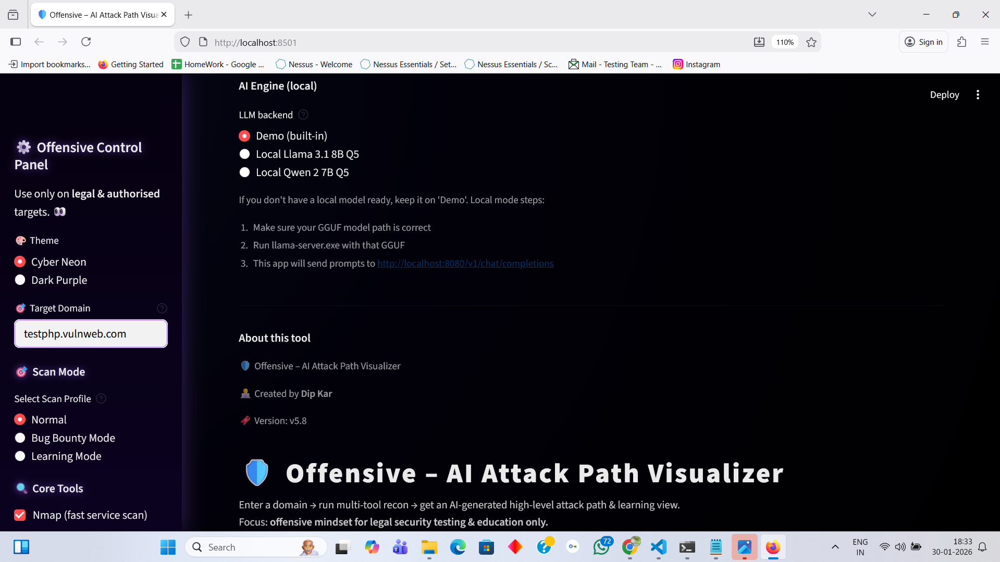
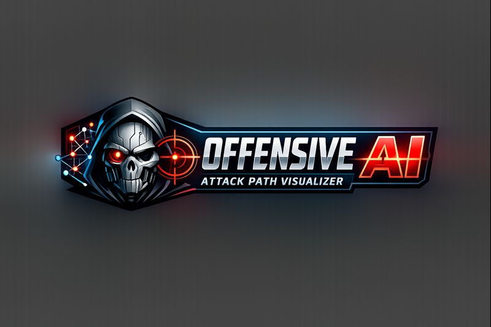

<p align="center">
  
</p>

<p align="center">
  
</p>

<h1 align="center">🛡️ Offensive AI – Attack Path Visualizer</h1>

<p align="center">
  <strong style="font-size:20px;">
    💻 Developed by Dip Kar (HackerBlazeX) 🚀
  </strong>
</p>

<p align="center">
  <strong style="font-size:18px;">
    ☕ Just give a domain — relax & sip your coffee. <br>
    🤖 Offensive AI handles 80% of the web penetration testing <br>
    📄 and delivers a ready-to-use report with AI-driven insights.
  </strong>
</p>

<p align="center">
AI-powered offensive security framework that transforms raw recon data into realistic, prioritised attack paths using local AI reasoning.
</p>

<p align="center">
⚠️ <strong>For legal & authorised security testing and educational purposes only.</strong>
</p>

---

## 🚀 What is Offensive AI?

**Offensive AI – Attack Path Visualizer** is a Windows-first offensive security framework designed to help security professionals **think like a real attacker**, not just collect tool outputs.

Instead of showing scattered scan results, this framework:
- Correlates recon & scan signals  
- Applies AI-driven reasoning using a **local LLM (llama.cpp)**  
- Generates **realistic attack paths**  
- Presents everything in a clean, analyst-friendly dashboard  

Built for **pentesters, red teamers, bug bounty hunters, and cybersecurity learners**.

---

## 🧠 The Problem It Solves

Traditional penetration testing often suffers from:
- Too many tools, too much noise  
- Disconnected findings  
- Manual decision-making fatigue  
- Difficulty deciding *what to exploit next*

**Offensive AI** bridges this gap by converting **raw technical data into structured offensive intelligence**.

---

## 🧠 How the Framework Works


The framework begins by collecting **raw signals** from multiple reconnaissance and scanning tools, such as:

- DNS resolution & reachability (nslookup, ping)
- Open ports & exposed services (Nmap)
- Subdomains (Subfinder)
- Live HTTP services, status codes & technologies (httpx)
- Known misconfigurations & CVE templates (Nuclei)
- Parameterised URLs (ParamSpider)
- Directory & file discovery (FFUF / Dirsearch)
- Web server misconfigurations (Nikto)
- Input-based testing signals (SQLMap, XSStrike)

All outputs are captured **as raw text**, without modifying or exploiting the target.

✔ No blind exploitation  
✔ Detection-focused  
✔ Scope-friendly  

---
### 2️⃣ Normalisation & Noise Reduction

Instead of showing messy tool output, the framework:
- Normalises data (domains, URLs, parameters)
- De-duplicates repeated findings
- Filters non-actionable noise

This ensures the tester focuses on **signal, not spam**.

Example:
Multiple URLs → unique parameterised endpoints
Multiple ports → parsed open services
Multiple subdomains → consolidated attack surface


---

### 3️⃣ Correlation Engine (Human-like Logic)

This is the **core brain before AI**.

The framework correlates findings across tools to build **context**, such as:

- Open web ports + subdomains + login hints
- Parameterised URLs + SQLMap/XSS signals
- Nikto misconfigs + Nuclei template hits
- Many subdomains → higher chance of forgotten assets

Isolated issues are converted into **meaningful attack hypotheses**.

> Example logic:
Parameterised URL

SQLMap heuristic signal

XSStrike reflection
= High-value input validation hotspot


---

### 4️⃣ AI Reasoning Layer (Local LLM – Optional)

The AI layer uses **llama.cpp with GGUF models**, running **fully locally**.

The AI:
- Reads the correlated attack surface summary
- Mimics attacker-style reasoning
- Suggests **high-level attack paths**
- Explains **why certain areas matter more**

✔ Fully offline  
✔ No cloud API  
✔ Privacy-first  
✔ Exploit-less (planning only)

AI is used for **decision support**, not automated hacking.

---

### 5️⃣ Attack Path Generation

Based on correlation + AI reasoning, the framework generates:

- Step-by-step **attack paths**
- Logical phases:
Recon → Entry Point → Expansion → Impact
- Priority scoring (Critical / High / Medium / Low)
- Risk context for each hotspot

This helps answer the real question:
> *“If I were attacking this legally, where would I start?”*

---

### 6️⃣ OWASP Top 10 Mapping (Signal-Based)

Each finding is approximately mapped to **OWASP Top 10 categories**, such as:

- A01 – Broken Access Control  
- A03 – Injection (SQLi / XSS / Input issues)  
- A05 – Security Misconfiguration  
- A07 – Identification & Authentication Failures  

⚠️ This is **signal-based mapping**, not a final verdict.  
It is meant to make results:
- Report-ready
- Management-friendly
- Easier to explain to non-technical stakeholders

---

### 7️⃣ Risk Scoring & Prioritisation

The framework calculates a **rough risk score (0–100)** based on:
- Number of open ports
- Severity of Nuclei findings
- Correlated vulnerability signals
- Breadth of attack surface

This score is:
- Visual
- Educational
- Trendable (per session)

It is **not a CVSS replacement**, but a prioritisation aid.

---

### 8️⃣ Visualisation Layer (Streamlit UI)

All insights are presented through a clean Streamlit dashboard:

- Attack surface overview
- Risk metrics & trends
- Open port & subdomain graphs
- OWASP Top 10 tables
- Timeline view (Recon → Attack planning)
- Graphviz attack surface map
- High-level attack tree visualisation

No messy terminal output.  
Only **clear offensive insight**.

---

### 9️⃣ Learning Mode & Explainability

Every major tool output can be:
- Explained in **beginner-friendly Hinglish**
- Interpreted using local AI (optional)
- Used as a learning reference

This makes the framework ideal for:
- Students
- Junior pentesters
- Interview preparation
- Red team mindset training

---

## ✨ Key Features (Expanded)

- 🔍 Multi-tool recon aggregation  
- 🧠 Human-like vulnerability correlation  
- 🤖 Local AI reasoning (llama.cpp, GGUF)  
- 📊 Risk-based prioritisation & scoring  
- 🧩 OWASP Top 10 signal mapping  
- 🌐 Visual attack surface & attack tree  
- 🧪 ParamSpider → SQLMap → XSStrike smart pipeline  
- 📈 Risk trend tracking (session-based)  
- 🧠 Explainable outputs (learning-first)  
- ⚡ Fast Streamlit UI  
- 🖥️ Offline / local-first architecture  
- 📄 One-click professional reporting & export  
- 🧾 Auto-generated attack surface & AI analysis report (Markdown)  
- 🧠 Complete machine-readable scan bundle (JSON)  
- ⏱️ Timestamped, domain-based filenames  
- ⬇️ Instant download from the dashboard
- 🛡️ Legal, authorised & exploit-less by design  
- 🎯 **Multiple Scan Modes**
- ⚙️ **Normal Mode** – Balanced recon & analysis for general security testing  
- 🏆 **Bug Bounty Mode** – Low-noise, safe, scope-friendly scanning ideal for bounty programs  
- 🎓 **Learning Mode** – Beginner-friendly explanations with AI-assisted reasoning (Hinglish support)
Each mode intelligently adjusts:
- 🧰 Tool execution behaviour  
- 🔊 Noise vs signal balance  
- 🧠 Explanation depth  
This makes the framework usable for **both professionals and learners** 🚀
- 📦 **Smart Dependency Checker & Auto Installer**
- Automatically checks required & optional tools on startup
- Detects missing tools in the user’s system
- Prompts the user before installing anything
- Installs missing tools automatically (Windows – Chocolatey based)
- Skips tools that are already installed
- Ensures a smooth, beginner-friendly first-time setup
- No manual dependency hunting or broken PATH issues


---

## ⚠️ Important Disclaimer

This framework is designed for:
- Legal & authorised security testing
- Education & learning
- Attack surface analysis
- Decision support

It does **NOT** provide:
- Exploit payloads
- Malware
- Illegal automation

Always follow scope, permissions, and local laws.
ℹ️ The framework never installs tools without explicit user consent.


---

## 🧰 Requirements

- Windows 10 / 11  
- Python **3.10+**  
- Git  
- Streamlit  
- llama.cpp (local LLM server)

---

## ⚙️ Installation (Windows – Easy)

```powershell
# 1️⃣ Clone the repository
git clone https://github.com/HackerBlazeX/Offensive-AI-Attack-Path-Visualizer.git
cd Offensive-AI-Attack-Path-Visualizer

# 2️⃣ Install dependencies
pip install -r requirements.txt

# 3️⃣ Start local LLM server (llama.cpp)
.\llama-server.exe -m path\to\model.gguf -c 4096 -t 6 -ngl 35

# 4️⃣ Run the framework
streamlit run Offensive-AI.py

# 5️⃣ Open in browser
http://localhost:8501

## ⚠️ Important: Hardcoded Paths Notice

Some paths inside the framework (for example **ParamSpider results directory, Nikto path, local tool locations**)  
are currently **configured based on the developer’s local Windows environment**.

🔧 **What you need to do:**
- Review variables like:
  - `PARAMSPIDER_BASE`
  - `PARAMSPIDER_RESULTS_DIR`
  - `nikto_path`
- Update them **according to your own system paths** if required.

💡 This design choice was made to:
- Keep the framework simple and readable
- Allow beginners to understand how tools interact
- Avoid complex environment abstractions in early versions

Future versions may introduce:
- Auto path detection
- Config file–based path management

✔️ Once paths are adjusted, the framework works normally.


⚠️ Important Note

This framework is not an auto-exploitation tool.
It is an AI-assisted offensive decision-support system designed to:

Reduce manual analysis time

Improve attack planning

Enhance learning and reporting quality

🔐 Legal Disclaimer

This project is intended only for authorised security testing, research, and education.
The author is not responsible for misuse or illegal activity.

📄 License

Licensed under the MIT License.
See the LICENSE file for details.

👨‍💻 Author

Dip Kar
Cybersecurity | Offensive Security | AI × Security

⭐ Support

If you find this project useful:

⭐ Star the repository

🧠 Share feedback

🚀 Contribute ideas or improvements


